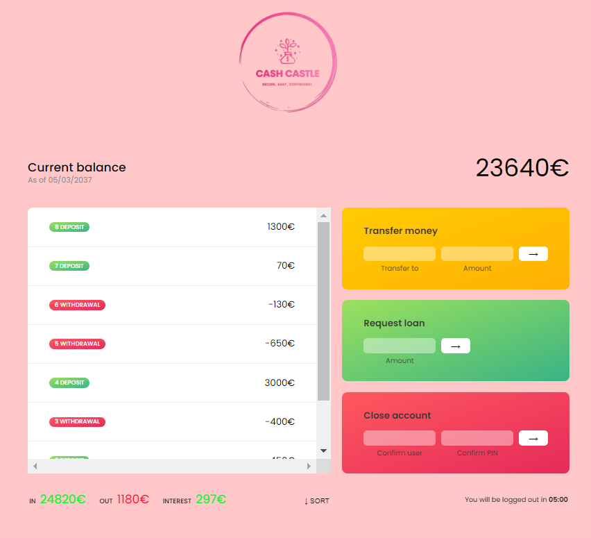

 
<h1 align="center"> <strong> CASH CASTLE🤑 </strong> </h1> 
<h1 align="center"><a href="https://thowfeeksalim.github.io/cash-castle-ui">Live Demo</a></h1>

### A fictional and simple internet banking tool called cashcastle gives users the following options:
- Enter a username and password 
- See and sort their financial transactions
- Move money to another account 
- Inquire about a bank loan 
- Get their account deleted

## Login information
- Login as `ts` with password `1234`.
- Login as `ss` with password `4321`.

## Main features of Cash Castle

#### Data: The program contains two different accounts with different data. Each account has an owner's name, movements (an array of numbers), interest rate, pin, movement dates, currency, and locale.

#### Elements: The program has various HTML elements that are used to display account details, including labels for welcome message, date, balance, summary of transactions (in, out, and interest), and a timer. It also includes a container for displaying account movements and buttons for different actions, such as login, transfer, loan, close account, and sorting of movements.

#### Functions: The program includes various functions that are used to format dates and currencies, display account movements, and perform different banking operations such as logging in, transferring money, requesting loans, and closing accounts

## Deployment

Deployed Website: https://thowfeeksalim.github.io/cash-castle-ui/

<!--  -->

## Built with

I built this repo using:

 - HMTL
 - CSS
 - JAVASCRIPT

## Live Demo

[Click on this link to play the game](https://github.com/thowfeeksalim/cash-castle-ui)

 ## Author

👤 **Thowfeek Salim**

- GitHub: [@Thowfeeksalim](https://github.com/thowfeeksalim)
- Twitter: [@Thowfeeksalim06](https://twitter.com/thowfeeksalim6) 
- LinkedIn: [Thowfeeksalim](https://www.linkedin.com/in/thowfeek-salim-294760211) 

## Getting Started

To get a local copy up and running follow these simple example steps.

### Prerequisites

Have a pc running Linux, MacOS or Windows.

### Setup

Get a copy of the repo using this command

`git clone https://github.com/thowfeeksalim/cash-castle-ui.git`

### Usage

To acces the repo run this command `cd cash-castle-ui`, and then open the `index.html` file with the live server of your choice.

## 🤝 Contributing

Contributions, issues and feature requests are welcome!

Feel free to check the [issues page](https://github.com/thowfeeksalim/cash-castle-ui/issues).

## Show your support

Give a ⭐️ if you like this project!

## License

This project is licensed under the MIT License.

Copyright (c) 2023 Thowfeek Salim

Permission is hereby granted, free of charge, to any person obtaining a copy
of this software and associated documentation files (the "Software"), to deal
in the Software without restriction, including without limitation the rights
to use, copy, modify, merge, publish, distribute, sublicense, and/or sell
copies of the Software, and to permit persons to whom the Software is
furnished to do so, subject to the following conditions:

The above copyright notice and this permission notice shall be included in all
copies or substantial portions of the Software.

THE SOFTWARE IS PROVIDED "AS IS", WITHOUT WARRANTY OF ANY KIND, EXPRESS OR
IMPLIED, INCLUDING BUT NOT LIMITED TO THE WARRANTIES OF MERCHANTABILITY,
FITNESS FOR A PARTICULAR PURPOSE AND NONINFRINGEMENT. IN NO EVENT SHALL THE
AUTHORS OR COPYRIGHT HOLDERS BE LIABLE FOR ANY CLAIM, DAMAGES OR OTHER
LIABILITY, WHETHER IN AN ACTION OF CONTRACT, TORT OR OTHERWISE, ARISING FROM,
OUT OF OR IN CONNECTION WITH THE SOFTWARE OR THE USE OR OTHER DEALINGS IN THE
SOFTWARE.

                                            

                   
&nbsp;
&nbsp;
&nbsp;

 

  <a href="https://thowfeeksalim.github.io/cash-castle-ui" target="blank">View Demo</a>
  ·
  <a href="https://github.com/thowfeeksalim/cash-castle-ui/issues/new/choose">Report Bug</a>
  ·
  <a href="https://github.com/thowfeeksalim/cash-castle-ui/issues/new/choose">Request Feature</a>

 
 

## ScreenShot

